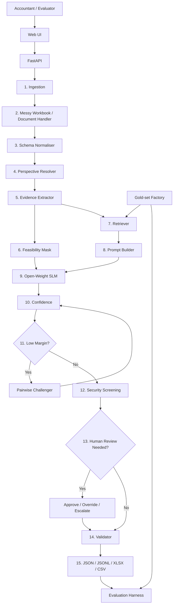
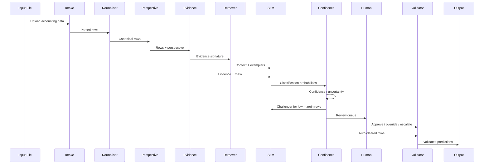
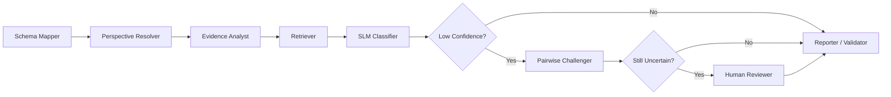

# VouchIQ

**Evidence-grounded voucher intelligence for Indian accounting data, powered by open-weight small language models.**

|                           |                                                                                   |
| ------------------------- | --------------------------------------------------------------------------------- |
| **Event**                 | Hacktober Fest — Open Source AI Hackathon (organized by Elevate)                  |
| **Round**                 | Qualifier — README-only technical proposal                                        |
| **Selected challenge**    | Challenge 4 — **VYOM+ Intelligent Voucher Classification Using Open-Source LLMs** |
| **Team**                  | CodeCarto                                                                         |
| **Repository**            | `vouchiq`                                                                         |
| **Engine**                | `vouch-engine` — offline classification runtime                                   |
| **Primary AI**            | Open-weight small language model, selected through a controlled model bake-off    |
| **Planned default model** | Qwen3.5-4B, 4-bit quantised for local inference                                   |
| **Planned challenger**    | Gemma 4 E4B / Qwen3.5-9B                                                          |
| **Planned license**       | Apache-2.0 for project code, subject to dependency and model terms                |
| **Repository status**     | README-only qualifier proposal; implementation is planned for the final hackathon |

### At a glance

|                          |                                                                                                                                                                                                                                                                                                                     |
| ------------------------ | ------------------------------------------------------------------------------------------------------------------------------------------------------------------------------------------------------------------------------------------------------------------------------------------------------------------- |
| **Input**                | Structured Excel/CSV accounting transactions with the voucher type missing, with optional document-intake support for PDFs and bill images                                                                                                                                                                          |
| **Output**               | One of **27 voucher categories**, confidence, evidence, alternatives, and a `needs_review` flag                                                                                                                                                                                                                     |
| **Primary intelligence** | An open-weight small language model used for semantic voucher classification                                                                                                                                                                                                                                        |
| **Key ideas**            | (1) Resolve **whose books these are** before reasoning. (2) Deterministic code extracts evidence; the LLM makes the semantic classification. (3) Confidence and uncertainty are explicit. (4) Human review is part of the workflow. (5) Evaluation is designed around synthetic, perturbed and human-verified data. |
| **Privacy model**        | Local-first and offline by default; no proprietary API in the classification decision path                                                                                                                                                                                                                          |
| **Not in scope**         | GST filing, regulatory certification, ledger/Dr-Cr generation and a full ERP replacement                                                                                                                                                                                                                            |

### Contents

1. [Project Name](#1-project-name)
2. [Problem Statement](#2-problem-statement)
3. [Project Overview](#3-project-overview)
4. [Proposed Solution](#4-proposed-solution)
5. [Objectives](#5-objectives)
6. [Target Users / Use Case](#6-target-users--use-case)
7. [Open-Source AI Technology Selected](#7-open-source-ai-technology-selected)
8. [Why This Technology Was Selected](#8-why-this-technology-was-selected)
9. [AI's Role in the System](#9-ais-role-in-the-system)
10. [System Architecture](#10-system-architecture)
11. [Component-Level Architecture](#11-component-level-architecture)
12. [Data / Information Flow](#12-data--information-flow)
13. [Agentic Workflow](#13-agentic-workflow)
14. [Technology Stack](#14-technology-stack)
15. [Expected Features](#15-expected-features)
16. [Implementation Approach](#16-implementation-approach)
17. [Expected Final Output](#17-expected-final-output)
18. [Future Scope / Scalability](#18-future-scope--scalability)
19. [Open-Source Dependencies / Components](#19-open-source-dependencies--components)
20. [Expected Challenges and Mitigation](#20-expected-challenges-and-mitigation)

Appendices: [A. Label playbook](#appendix-a--label-playbook) · [B. Evaluation protocol](#appendix-b--evaluation-protocol) · [C. Anticipated reviewer questions](#appendix-c--anticipated-reviewer-questions) · [D. References](#appendix-d--references)

---

## 1. Project Name

**VouchIQ** — **Voucher + Intelligence**.

VouchIQ is proposed as an offline-first AI system for classifying Indian accounting records into the voucher category they represent.

> **One-line pitch:** Give VouchIQ a spreadsheet of accounting transactions with the voucher type missing, and it will determine the most likely voucher category for every row, explain the evidence behind the decision, provide calibrated confidence, and route genuinely uncertain records to human review.

The project is designed specifically around the challenge of using open-weight AI for a practical accounting workflow rather than treating an LLM as a generic chatbot.

---

## 2. Problem Statement

> **Selected track: Challenge 4 — VYOM+ Intelligent Voucher Classification Using Open-Source LLMs.**

The proposed task is to classify structured Indian accounting records when the **voucher type is missing**.

The input can contain transaction information such as seller, buyer, invoice number, date, items, quantity, taxable value, GST, payment details, references, payroll information and narration.

The system must infer the intended voucher type from these signals.

### 2.1 The real-world problem

Accounting systems do not always receive clean, labelled records.

Transactions may originate from:

* ERP exports;
* billing software;
* accounting spreadsheets;
* marketplace systems;
* bank-related records;
* procurement workflows;
* internal stock movements;
* payroll systems;
* manually prepared Excel files.

These records may tell us **what happened**, while omitting the higher-level accounting classification of **what voucher this represents**.

A human accountant can infer the category by combining multiple fields.

For example:

* Seller = reporting entity → likely **Sales**
* Buyer = reporting entity → likely **Purchase**
* Foreign supplier + customs evidence → likely **Import**
* Foreign customer + shipping evidence → likely **Export**
* Bank-to-cash transfer → likely **Contra**
* Employee + pay period + deductions → likely **Salary / Payroll**
* Quantity movement without monetary posting → possibly **Material In**, **Material Out**, **Receipt Note** or **Delivery Note**

The challenge is therefore not simple keyword matching.

It is **structured semantic interpretation under incomplete evidence**.

### 2.2 Why it is genuinely hard

| #  | Difficulty                 | Why a simple approach fails                                                                            |
| -- | -------------------------- | ------------------------------------------------------------------------------------------------------ |
| 1  | **Perspective dependence** | The same commercial event can represent Purchase or Sales depending on whose books are being prepared. |
| 2  | **Look-alike categories**  | Purchase/Sales, Payment/Contra, Journal/Expense and document-vs-voucher pairs can share vocabulary.    |
| 3  | **Overlapping concepts**   | Import can also be a Purchase, while an Advance can also involve Payment or Receipt.                   |
| 4  | **Sparse records**         | Some rows have no tax, no party, no money, or no invoice number.                                       |
| 5  | **Messy schemas**          | Real spreadsheets may have renamed columns, title rows, merged cells or multiple sheets.               |
| 6  | **Multilingual data**      | Indian accounting data can contain English, Hindi, Marathi and mixed-language narration.               |
| 7  | **Document variation**     | Structured spreadsheets and visual documents expose information differently.                           |
| 8  | **Ambiguous cases**        | Some records genuinely do not contain enough evidence for confident classification.                    |
| 9  | **Noisy text**             | Narrations can contain irrelevant text or malicious prompt-injection instructions.                     |
| 10 | **Evaluation difficulty**  | A system cannot be trusted merely because it performs well on synthetic examples.                      |

### 2.3 Why existing approaches fall short

| Approach                       | Strength                                          | Limitation                                                                  |
| ------------------------------ | ------------------------------------------------- | --------------------------------------------------------------------------- |
| Keyword / regex                | Fast and transparent                              | Cannot reliably combine relationships between many fields                   |
| Classical ML                   | Strong when labelled data is abundant             | Requires a representative labelled training set                             |
| Raw LLM prompting              | Flexible semantic reasoning                       | Can be unstable, difficult to calibrate and vulnerable to ambiguous context |
| Hosted LLM API                 | Convenient                                        | Privacy, cost and reproducibility concerns                                  |
| Pure rules                     | Deterministic                                     | Brittle against unseen schemas and language variation                       |
| **Evidence + open-weight SLM** | Combines structured facts with semantic reasoning | Requires careful prompt, scoring and evaluation design                      |

### 2.4 Formal task definition

Let:

$$
D = \{r_1, r_2, \ldots, r_N\}
$$

represent an input dataset of transaction rows.

For each row \(r_i\), VouchIQ will produce:

$$
(\hat{y_i}, c_i, e_i, q_i)
$$

where:

* \(\hat{y_i}\) = predicted voucher category;
* \(c_i \in [0,1]\) = confidence;
* \(e_i\) = evidence supporting the decision;
* \(q_i\) = review state.

The label \(\hat{y_i}\) will belong to the predefined 27-label taxonomy.

### 2.5 Scope

| In scope                 | Out of scope                      |
| ------------------------ | --------------------------------- |
| Voucher classification   | GST return filing                 |
| Evidence extraction      | Regulatory certification          |
| Confidence estimation    | Full accounting ledger generation |
| Human review             | Automatic tax/legal sign-off      |
| Excel/CSV processing     | Full ERP replacement              |
| Optional document intake | Guaranteed OCR accuracy           |
| Open-weight local SLM    | Mandatory cloud inference         |

### Assumptions

* The input represents one or more accounting entities.
* The voucher-type label is absent or intentionally withheld.
* The data can be represented as structured fields after ingestion.
* The final classification must belong to the organiser-defined label taxonomy.
* Ambiguous records should be reviewable instead of being forced into a false certainty.

---

## 3. Project Overview

VouchIQ will be designed as a **complete voucher-intelligence pipeline** rather than a single classification prompt.

The proposed pipeline is:

```text
Input
  ↓
Ingestion
  ↓
Schema Normalisation
  ↓
Perspective Resolution
  ↓
Evidence Extraction
  ↓
Evidence Grounding
  ↓
Open-Weight SLM
  ↓
Confidence
  ↓
Challenger for uncertain rows
  ↓
Human Review
  ↓
Validated Output
```

### Three core ideas

#### 1. Perspective first

VouchIQ will first attempt to identify **whose books the transaction belongs to**.

The system will use signals such as:

* party frequency;
* seller/buyer recurrence;
* GSTIN patterns;
* invoice-number series;
* document direction;
* consistency across rows.

This is particularly important for differentiating Purchase and Sales.

#### 2. Code supplies evidence; AI supplies semantic judgement

Deterministic code will calculate facts such as:

```text
PERSPECTIVE: seller
HAS_ITEMS: yes
TAX: CGST+SGST
CURRENCY: INR
REFS_ORDER: yes
DOC_SIGN: negative
```

The model will then reason over those signals and decide which label best explains the transaction.

#### 3. Uncertainty is part of the product

A prediction will not be represented only as:

```text
Sales
```

It will instead contain:

```text
Sales
Confidence: 0.93
Alternatives:
  Purchase: 0.04
  Export: 0.02
Needs review: No
Evidence:
  perspective=seller
  items=yes
  GST=CGST+SGST
```

This enables human-in-the-loop workflows instead of pretending every row is equally certain.

---

## 4. Proposed Solution

### 4.1 Design principles

| Principle                                        | Consequence                                                                                            |
| ------------------------------------------------ | ------------------------------------------------------------------------------------------------------ |
| **P1. AI should perform the semantic judgement** | Rules will provide evidence rather than secretly hard-code the final answer.                           |
| **P2. Perspective before classification**        | Purchase/Sales reasoning begins with identifying the reporting entity.                                 |
| **P3. Evidence before prompting**                | Raw tables will be transformed into meaningful accounting signals.                                     |
| **P4. Confidence must be measurable**            | The model output will be converted into a probability/confidence representation.                       |
| **P5. Spend compute on ambiguity**               | Low-margin predictions receive extra reasoning instead of every row receiving the most expensive path. |
| **P6. Humans control uncertainty**               | Low-confidence rows can be approved, overridden or escalated.                                          |
| **P7. Fail closed**                              | Invalid model responses will never silently become valid-looking accounting labels.                    |
| **P8. Evaluate honestly**                        | Synthetic and human-labelled evaluation will be clearly separated.                                     |
| **P9. Privacy by design**                        | Local inference is preferred for sensitive accounting information.                                     |

### 4.2 Proposed pipeline

| Stage | Function             | Purpose                                                    |
| ----- | -------------------- | ---------------------------------------------------------- |
| 1     | Input ingestion      | Accept structured transaction data                         |
| 2     | Workbook profiling   | Detect meaningful headers, sheets and structural anomalies |
| 3     | Schema normalisation | Map arbitrary columns to canonical accounting fields       |
| 4     | Perspective resolver | Infer reporting-entity viewpoint                           |
| 5     | Evidence extractor   | Generate accounting evidence tags                          |
| 6     | Feasibility analysis | Penalise logically implausible categories                  |
| 7     | Evidence retrieval   | Retrieve relevant examples/playbook context                |
| 8     | SLM scoring          | Produce the primary semantic classification                |
| 9     | Confidence layer     | Estimate confidence and uncertainty                        |
| 10    | Challenger           | Re-check close classifications                             |
| 11    | Security analysis    | Screen untrusted narration and URLs                        |
| 12    | Human gate           | Approve, override or escalate                              |
| 13    | Validation           | Enforce output contract                                    |
| 14    | Export               | Produce machine-readable results                           |
| 15    | Evaluation           | Generate metrics and error analysis                        |

### 4.3 Hierarchical label coding

The 27 labels will be organised into seven semantic groups.

| Group | Name                              | Members                                                                                                                           |
| ----- | --------------------------------- | --------------------------------------------------------------------------------------------------------------------------------- |
| **A** | Trade invoices                    | Purchase · Sales · Import · Export                                                                                                |
| **B** | Returns and rejections            | Purchase Return / Debit Note · Sales Return / Credit Note · Rejection Out · Rejection In                                          |
| **C** | Money movement                    | Payment · Receipt · Contra · Advance / Prepayment                                                                                 |
| **D** | Non-cash ledger and miscellaneous | Journal · Expense · Other / Miscellaneous                                                                                         |
| **E** | People                            | Salary / Payroll · Attendance                                                                                                     |
| **F** | Orders and movement documents     | Purchase Order · Sales Order · Receipt Note · Delivery Note · Material In · Material Out · Job Work In Order · Job Work Out Order |
| **G** | Stock accounting                  | Stock Journal · Physical Stock                                                                                                    |

The model will first reason about the broad semantic group and then about the member label.

This reduces the effective search space and makes error analysis more meaningful.

### 4.4 Label precedence policy

Some labels describe overlapping aspects of the same transaction.

VouchIQ will therefore define an explicit precedence policy:

| Overlap                          | Proposed policy                                                                              |
| -------------------------------- | -------------------------------------------------------------------------------------------- |
| Import vs Purchase               | Specific cross-border evidence should favour Import                                          |
| Export vs Sales                  | Specific export/shipping evidence should favour Export                                       |
| Expense vs Purchase              | Service/overhead activity without stock evidence should favour Expense                       |
| Advance vs Payment/Receipt       | Money moved before invoice settlement should favour Advance / Prepayment                     |
| Purchase Return vs Rejection Out | Value-bearing reversal + invoice reference should favour Purchase Return / Debit Note        |
| Sales Return vs Rejection In     | Value-bearing customer reversal + invoice reference should favour Sales Return / Credit Note |
| Other / Miscellaneous            | Last-resort category only                                                                    |

This policy will remain versioned so the final implementation can follow the organiser's exact label definitions.

---

## 5. Objectives

The following are **targets**, not claimed results.

| #   | Objective                              | Metric                                           | Target                            |
| --- | -------------------------------------- | ------------------------------------------------ | --------------------------------- |
| O1  | Accurate 27-way classification         | Macro-F1                                         | ≥ 0.85                            |
| O2  | Strong performance on look-alike pairs | Pairwise F1                                      | ≥ 0.80                            |
| O3  | Trustworthy confidence                 | ECE                                              | ≤ 0.08                            |
| O4  | Graceful missing-field handling        | Macro-F1 degradation                             | ≤ 10 points                       |
| O5  | Schema robustness                      | Performance difference after header perturbation | ≤ 5 points                        |
| O6  | Efficient inference                    | Single-pass coverage                             | ≥ 85% of rows                     |
| O7  | Reproducibility                        | Deterministic regeneration                       | Pass                              |
| O8  | Privacy                                | Proprietary API in decision path                 | None                              |
| O9  | Review efficiency                      | Human review coverage                            | Focus on genuinely uncertain rows |
| O10 | Safety                                 | Invalid outputs silently accepted                | 0                                 |

### Non-goals

VouchIQ will not attempt to:

* replace a full accounting platform;
* provide legal or tax advice;
* claim regulatory certification;
* eliminate accountants;
* guarantee correct classification in genuinely ambiguous records.

---

## 6. Target Users / Use Case

### 6.1 Personas

| Persona                          | Problem                                                         | VouchIQ value                                  |
| -------------------------------- | --------------------------------------------------------------- | ---------------------------------------------- |
| **CA firms and bookkeepers**     | Large data exports require repetitive voucher classification    | Bulk classification with confidence and review |
| **SME finance teams**            | Spreadsheet-heavy workflows create manual classification effort | Local, private voucher intelligence            |
| **Accounting software vendors**  | Need an intermediate intelligence layer before voucher creation | API-ready classifier architecture              |
| **Auditors / controllers**       | Need to identify potentially misclassified transactions         | Prediction-vs-recorded audit mode              |
| **Data scientists / evaluators** | Need measurable and reproducible model comparison               | Explicit evaluation and ablation pipeline      |

### 6.2 Use cases

| Use case                              | Input                         | Output                         | Value                                |
| ------------------------------------- | ----------------------------- | ------------------------------ | ------------------------------------ |
| **UC1. Bulk voucher classification**  | Unlabelled workbook           | Voucher per row                | Reduces repetitive classification    |
| **UC2. Messy workbook processing**    | Multi-sheet/messy Excel       | Normalised transactions        | Works with realistic exports         |
| **UC3. Document-to-voucher pipeline** | Structured document text      | Voucher prediction             | Bridges extraction and accounting    |
| **UC4. Human review**                 | Low-confidence rows           | Approval/override/escalation   | Keeps humans in control              |
| **UC5. Retro-audit**                  | Historical labelled data      | Disagreement report            | Finds potentially misclassified rows |
| **UC6. Bank movement classification** | Payment/receipt/transfer rows | Payment/Receipt/Contra/Advance | Improves transaction categorisation  |
| **UC7. Developer integration**        | API/JSON rows                 | JSON prediction records        | Embeddable architecture              |

---

## 7. Open-Source AI Technology Selected

| Role                  | Proposed technology                | Purpose                                       |
| --------------------- | ---------------------------------- | --------------------------------------------- |
| **Primary SLM**       | **Qwen3.5-4B**                     | Main local semantic classifier                |
| **Challenger SLM**    | **Gemma 4 E4B**                    | Model comparison and difficult-row escalation |
| **Escalation model**  | **Qwen3.5-9B**                     | Optional higher-capacity reasoning tier       |
| **Inference runtime** | **llama.cpp**                      | Local quantised inference                     |
| **Retrieval**         | Evidence/exemplar retrieval        | Few-shot grounding                            |
| **Embeddings**        | Small multilingual embedding model | Header/exemplar matching                      |
| **Calibration**       | Temperature scaling                | Confidence calibration                        |
| **Baseline**          | Deterministic keyword classifier   | Evaluation baseline                           |
| **Validation**        | Pydantic                           | Output contract                               |

Gemma 4 E4B is an open-weight model with Apache 2.0 licensing and is positioned by Google for deployment on mobile devices and laptops, making it a practical candidate for the proposed local-model bake-off.

### Model selection rule

The final model will not be selected purely by popularity.

The candidates will be evaluated on:

* macro-F1;
* per-class recall;
* pairwise confusion;
* calibration;
* latency;
* memory usage;
* multilingual robustness.

The winner will be frozen before final submission.

---

## 8. Why This Technology Was Selected

### 8.1 Why a small language model

A voucher classification system does not require a model to produce long-form text.

The useful reasoning is concentrated in:

* semantic interpretation;
* multi-field relationships;
* accounting terminology;
* contextual ambiguity;
* narration understanding.

A small quantised model therefore offers a practical balance between reasoning capability and local hardware requirements.

### 8.2 Why local inference

Indian accounting information can contain:

* business names;
* GSTINs;
* invoice numbers;
* payment references;
* financial amounts;
* employee information.

Sending every transaction to an external provider is undesirable for many accounting workflows.

A local model enables:

* privacy;
* predictable inference cost;
* offline operation;
* reproducibility;
* greater control over model versions.

### 8.3 Why model diversity

Different models may behave differently on:

* Indian terminology;
* multilingual narration;
* sparse data;
* unusual voucher classes.

Therefore the architecture will keep multiple model families behind one scorer interface.

### 8.4 Why evidence + LLM

| Approach                       | Main problem                                                                   |
| ------------------------------ | ------------------------------------------------------------------------------ |
| Pure rules                     | Too brittle                                                                    |
| Raw LLM prompt                 | Too dependent on prompt interpretation                                         |
| Classical ML                   | Requires large representative labels                                           |
| Fine-tuning immediately        | Risks learning synthetic assumptions                                           |
| **Evidence + retrieval + SLM** | Gives the model structured context while keeping the reasoning path measurable |

### 8.5 Why Gemma 4 is a useful challenger

Gemma 4 supports multimodal inputs and is designed for on-device deployment across its smaller variants, including E4B.

That makes it particularly relevant for a future version of VouchIQ that can combine structured accounting fields with visual document evidence.

---

## 9. AI's Role in the System

VouchIQ will deliberately separate deterministic preprocessing from semantic AI reasoning.

| Task                             | Owner               |
| -------------------------------- | ------------------- |
| Detect file type                 | Code                |
| Parse spreadsheet structure      | Code                |
| Detect header row                | Code                |
| Normalise fields                 | Code                |
| Resolve reporting perspective    | Code                |
| Extract accounting evidence      | Code                |
| Build feasibility mask           | Code                |
| Retrieve relevant examples       | Retrieval system    |
| **Determine voucher meaning**    | **Open-weight SLM** |
| **Resolve close classification** | **SLM challenger**  |
| Calibrate confidence             | Statistical layer   |
| Decide human review state        | Policy + confidence |
| Approve/override final decision  | Human               |
| Validate schema                  | Code                |

### AI necessity test

Removing the LLM should remove the system's **semantic AI classification capability**.

The surrounding pipeline may still extract evidence, but it should not pretend that deterministic preprocessing is equivalent to AI reasoning.

This keeps the role of AI clear for the hackathon.

---

## 10. System Architecture



### 10.1 Architectural layers

| Layer                    | Responsibility                  |
| ------------------------ | ------------------------------- |
| **Interface**            | Upload, inspect, review, export |
| **Ingestion**            | Excel/CSV/document intake       |
| **Normalisation**        | Canonical schema                |
| **Accounting reasoning** | Perspective + evidence          |
| **AI**                   | Open-weight SLM classification  |
| **Reliability**          | Confidence + challenger         |
| **Security**             | Narration and URL screening     |
| **Human control**        | Review checkpoint               |
| **Quality**              | Evaluation and reproducibility  |

### 10.2 Deployment model

The primary target will be:

```text
Single laptop / workstation
        ↓
FastAPI
        ↓
VouchEngine
        ↓
Local model runtime
```

A stronger machine may replace the small-model inference tier with a larger local model.

A hosted architecture may be considered later, but the core hackathon design remains local-first.

---

## 11. Component-Level Architecture

| #   | Component                     | Purpose                                                    |
| --- | ----------------------------- | ---------------------------------------------------------- |
| C1  | **Input detector**            | Detect XLSX, CSV, PDF or image input                       |
| C2  | **Workbook profiler**         | Inspect sheet and header structure                         |
| C3  | **Messy-sheet handler**       | Handle title rows, merged cells and multiple sheets        |
| C4  | **Document parser**           | Convert document content into structured accounting fields |
| C5  | **OCR layer**                 | Extract text from scanned documents                        |
| C6  | **Schema normaliser**         | Map arbitrary fields to canonical schema                   |
| C7  | **Perspective resolver**      | Infer reporting entity                                     |
| C8  | **Evidence extractor**        | Compute accounting evidence                                |
| C9  | **Feasibility mask**          | Penalise implausible labels                                |
| C10 | **Retrieval layer**           | Retrieve similar labelled examples                         |
| C11 | **Prompt builder**            | Assemble structured model context                          |
| C12 | **SLM scorer**                | Generate semantic classification                           |
| C13 | **Confidence layer**          | Produce confidence and top alternatives                    |
| C14 | **Calibration layer**         | Improve probability reliability                            |
| C15 | **Challenger**                | Re-check low-margin predictions                            |
| C16 | **Prompt-injection firewall** | Screen malicious instructions                              |
| C17 | **Quishing scanner**          | Detect suspicious URLs                                     |
| C18 | **Review manager**            | Maintain human decisions                                   |
| C19 | **Validator**                 | Enforce exact output schema                                |
| C20 | **Export layer**              | Write machine-readable results                             |
| C21 | **Evaluation harness**        | Compute metrics                                            |
| C22 | **Gold-set factory**          | Produce evaluation data                                    |
| C23 | **API layer**                 | Expose programmatic access                                 |
| C24 | **Web UI**                    | Give evaluators an interactive workflow                    |

### 11.1 Evidence families

| Family         | Example                                 |
| -------------- | --------------------------------------- |
| Perspective    | `PERSPECTIVE: seller`                   |
| Document       | `DOC_SIGN: negative`                    |
| Items          | `HAS_ITEMS: yes`                        |
| Quantity       | `QTY_ONLY: yes`                         |
| Tax            | `TAX: CGST+SGST`                        |
| Tax arithmetic | `TAX_ARITHMETIC: consistent`            |
| Payment        | `PAY_MODE: bank`                        |
| Ledger         | `LEDGER_PAIR: bank-to-cash`             |
| Currency       | `CURRENCY: USD (foreign)`               |
| Customs        | `HAS_CUSTOMS_FIELDS: yes`               |
| Shipping       | `HAS_SHIPPING_BILL: yes`                |
| People         | `EMPLOYEE_FIELDS: yes`                  |
| References     | `REFS_INVOICE: yes`                     |
| Narration      | `CUE: "advance"`                        |
| Missing data   | `NO_PARTY`, `NO_ITEMS`, `NO_INVOICE_NO` |

### 11.2 Canonical schema

The proposed canonical structure will cover:

```text
seller
seller.gstin
buyer
buyer.gstin

doc.invoice_number
doc.date

items.desc
items.qty
items.rate
items.amount
items.hsn

money.taxable
money.cgst
money.sgst
money.igst
money.total
money.currency
money.discount
money.freight

pay.mode
pay.utr
pay.debit
pay.credit

people.employee
people.period
people.earnings
people.deductions
people.attendance

refs.invoice
refs.order
refs.receipt_note
refs.delivery

narration
```

---

## 12. Data / Information Flow



### 12.1 Data contracts

| Hand-off                 | Payload                      | Guarantee                     |
| ------------------------ | ---------------------------- | ----------------------------- |
| Intake → Normaliser      | Raw rows + headers           | Parsed input                  |
| Normaliser → Perspective | Canonical rows               | Standard field representation |
| Perspective → Evidence   | Rows + reporting perspective | Explicit viewpoint            |
| Evidence → Scorer        | Tags + mask                  | Structured evidence           |
| Scorer → Confidence      | Label probabilities          | Ranked alternatives           |
| Confidence → Review      | Prediction + uncertainty     | Review decision               |
| Human → Validator        | Final decision               | Explicit approval state       |
| Validator → Output       | Valid records                | One valid voucher per row     |

### 12.2 Illustrative example

Input:

```text
Seller: Sharma Traders
Buyer: Nagpur Agro Pvt Ltd
Invoice: SI/26-27/0412
Description: Office Chairs
Quantity: 10
Taxable Value: ₹50,000
CGST: ₹4,500
SGST: ₹4,500
```

Evidence:

```text
PERSPECTIVE: seller
HAS_ITEMS: yes
DOC_SIGN: positive
TAX: CGST+SGST
TAX_ARITHMETIC: consistent
CURRENCY: INR
```

Possible result:

```json
{
  "row_id": 1,
  "invoice_number": "SI/26-27/0412",
  "voucher_type": "Sales",
  "confidence": 0.97,
  "needs_review": false,
  "top_k": [
    ["Sales", 0.97],
    ["Delivery Note", 0.01],
    ["Export", 0.01]
  ],
  "evidence": [
    "PERSPECTIVE: seller",
    "HAS_ITEMS: yes",
    "TAX: CGST+SGST",
    "TAX_ARITHMETIC: consistent"
  ]
}
```

The data above is fictional and exists only to demonstrate the intended contract.

---

## 13. Agentic Workflow

VouchIQ will use a **bounded agentic workflow** instead of an uncontrolled autonomous agent.

The system will have specialised roles but fixed execution limits.



### Agent roles

| Role                     | Input                       | Output                    |
| ------------------------ | --------------------------- | ------------------------- |
| **Schema Mapper**        | Raw headers                 | Canonical field mapping   |
| **Perspective Resolver** | Parties + document patterns | Reporting entity          |
| **Evidence Analyst**     | Canonical transaction       | Evidence tags             |
| **Retriever**            | Evidence signature          | Relevant examples         |
| **Classifier**           | Evidence + context          | Voucher probabilities     |
| **Challenger**           | Top competing labels        | Pairwise decision         |
| **Human Reviewer**       | Uncertain prediction        | Approve/override/escalate |
| **Reporter**             | Final state                 | Validated result          |

### Guardrails

The workflow will use:

* fixed role order;
* bounded tool calls;
* no uncontrolled external tools;
* fixed model configuration;
* explicit state transitions;
* validation after every critical boundary;
* a review path for unresolved ambiguity.

The goal is to obtain the advantages of agentic decomposition without introducing uncontrolled agent behaviour.

---

## 14. Technology Stack

| Layer            | Proposed technology                     | Purpose                    |
| ---------------- | --------------------------------------- | -------------------------- |
| Language         | **Python 3.11+**                        | Core engine                |
| Data             | **pandas**                              | Tabular processing         |
| Spreadsheet      | **openpyxl**                            | XLSX processing            |
| Validation       | **Pydantic**                            | Typed contracts            |
| Fuzzy matching   | **RapidFuzz**                           | Header/entity matching     |
| Metrics          | **scikit-learn**                        | Evaluation and calibration |
| AI runtime       | **llama.cpp**                           | Local inference            |
| Model            | **Qwen3.5-4B**                          | Main SLM                   |
| Model challenger | **Gemma 4 E4B**                         | Alternative model          |
| Retrieval        | **FAISS / lightweight retrieval layer** | Example grounding          |
| Embeddings       | **Multilingual embedding model**        | Semantic matching          |
| OCR              | **Tesseract**                           | Scanned document text      |
| PDF              | **PyMuPDF / PDF renderer**              | Document processing        |
| Images           | **Pillow**                              | Image handling             |
| Backend          | **FastAPI**                             | API                        |
| Frontend         | **React + TypeScript + Vite**           | Web application            |
| Containers       | **Docker / Docker Compose**             | Packaging                  |
| Testing          | **pytest**                              | Unit/integration testing   |
| Linting          | **Ruff**                                | Code quality               |
| CI               | **GitHub Actions**                      | Reproducible verification  |

Gemma 4's smaller E4B variant is specifically documented by Google for laptop/mobile-oriented deployment, while the family supports text and image input.

---

## 15. Expected Features

### Must-have

| Feature                    | Purpose                                    |
| -------------------------- | ------------------------------------------ |
| **27-label classifier**    | Core challenge requirement                 |
| **Excel/CSV ingestion**    | Main structured input                      |
| **Schema normalisation**   | Handle unknown headers                     |
| **Perspective resolver**   | Improve direction-sensitive classification |
| **Evidence extraction**    | Provide structured reasoning context       |
| **Open-weight SLM scorer** | Primary AI component                       |
| **Confidence estimation**  | Communicate uncertainty                    |
| **Human review queue**     | Prevent blind automation                   |
| **Validated JSON output**  | Machine-readable submission format         |
| **Evaluation report**      | Demonstrate measurable quality             |
| **Evaluator-friendly UI**  | Make the system easy to inspect            |

### Should-have

| Feature                      | Purpose                              |
| ---------------------------- | ------------------------------------ |
| Retrieval grounding          | Better few-shot context              |
| Pairwise challenger          | Improve look-alike classification    |
| Confidence calibration       | Improve reliability                  |
| Messy workbook support       | Handle real-world spreadsheets       |
| Hindi/Marathi header support | Improve Indian-data robustness       |
| PDF/document intake          | Extend beyond clean spreadsheets     |
| Retro-audit mode             | Compare recorded and predicted types |

### Could-have

| Feature                    | Purpose                                    |
| -------------------------- | ------------------------------------------ |
| OCR document pipeline      | Visual document support                    |
| Cross-record corroboration | Use document-chain context                 |
| Larger-model escalation    | More reasoning capacity                    |
| Per-firm exemplar memory   | Customer-specific adaptation               |
| QLoRA adaptation           | Domain-specific fine-tuning                |
| Agent Skill package        | Reusable voucher-classification capability |

---

## 16. Implementation Approach

### 16.1 Strategy

The implementation will follow a **measured vertical-slice strategy**.

Rather than spending the entire hackathon building infrastructure first, the first complete path will be:

```text
Input
→ classify
→ output
→ evaluate
```

Every additional component will then be justified by measurable improvement.

### 16.2 Development phases

| Phase                    | Goal                             | Deliverable                     |
| ------------------------ | -------------------------------- | ------------------------------- |
| **P0. Setup**            | Environment and model runtime    | Working development environment |
| **P1. Baseline**         | Establish deterministic baseline | First predictions + metrics     |
| **P2. Core pipeline**    | Schema + perspective + evidence  | End-to-end evidence pipeline    |
| **P3. AI scoring**       | Open-weight SLM                  | AI classification               |
| **P4. Grounding**        | Retrieval + exemplars            | Context-aware scoring           |
| **P5. Reliability**      | Calibration + challenger         | Better uncertainty handling     |
| **P6. Human gate**       | Review flow                      | Approve/override/escalate       |
| **P7. Product UI**       | Evaluator-facing interface       | Upload/review/export UI         |
| **P8. Robustness**       | Messy data + multilingual cases  | Stress tests                    |
| **P9. Final evaluation** | Freeze and benchmark             | Final metrics and demo          |

### 16.3 Evaluation-driven development

Every major addition will be evaluated using an ablation:

```text
Baseline
  ↓
+ Schema
  ↓
+ Perspective
  ↓
+ Evidence
  ↓
+ Retrieval
  ↓
+ Feasibility
  ↓
+ Calibration
  ↓
+ Challenger
```

This will make it possible to answer:

> **Which component actually improved voucher classification?**

### 16.4 Compute plan

| Plan                         | Hardware   | Strategy                                         |
| ---------------------------- | ---------- | ------------------------------------------------ |
| **A — Laptop GPU**           | ~6 GB VRAM | Quantised 4B SLM                                 |
| **B — Stronger workstation** | More VRAM  | Larger local model                               |
| **C — CPU fallback**         | CPU-only   | Deterministic baseline / smaller quantised model |

### 16.5 Time-aware cut strategy

If time becomes limited:

**Keep**

* 27-label classifier;
* schema normalisation;
* perspective;
* evidence;
* open-weight SLM;
* output validation;
* UI;
* benchmark.

**Cut first**

* cross-record graph;
* QLoRA;
* advanced escalation;
* optional document extras.

### 16.6 Definition of done

The final submission should allow an evaluator to:

1. provide accounting data;
2. receive voucher classifications;
3. inspect evidence and confidence;
4. review uncertain rows;
5. export the final result;
6. reproduce the evaluation.

---

## 17. Expected Final Output

### 17.1 Minimum output

```json
{
  "invoice_number": "INV-2026-1042",
  "voucher_type": "Purchase"
}
```

### 17.2 Extended output

```json
{
  "row_id": 42,
  "invoice_number": "INV-2026-1042",
  "voucher_type": "Purchase",
  "confidence": 0.91,
  "needs_review": false,
  "top_k": [
    ["Purchase", 0.91],
    ["Import", 0.05],
    ["Purchase Order", 0.02]
  ],
  "evidence": [
    "PERSPECTIVE: buyer",
    "HAS_ITEMS: yes",
    "TAX: CGST+SGST"
  ]
}
```

### 17.3 Final submission artefacts

| Artefact                      | Purpose                             |
| ----------------------------- | ----------------------------------- |
| **VouchIQ source repository** | Complete open-source implementation |
| **Prediction JSONL**          | Machine-readable output             |
| **Prediction XLSX**           | Accountant-friendly output          |
| **Evaluation report**         | Accuracy/F1/calibration results     |
| **Confusion matrix**          | Error analysis                      |
| **Robustness report**         | Missing-field/schema tests          |
| **Model comparison**          | SLM bake-off                        |
| **Human review output**       | Final approval decisions            |
| **Demo UI**                   | Evaluator interaction               |
| **Technical documentation**   | Reproducibility                     |

---

## 18. Future Scope / Scalability

| Direction                       | Future capability                                                     |
| ------------------------------- | --------------------------------------------------------------------- |
| **Invoice intelligence**        | Combine OCR and document understanding with voucher classification    |
| **ERP integration**             | Connect classification directly to accounting workflows               |
| **Voucher generation**          | Create downstream voucher entries after classification                |
| **Tally integration**           | Generate compatible import formats                                    |
| **Human-in-the-loop learning**  | Learn from accountant corrections                                     |
| **Per-firm adaptation**         | Maintain firm-specific examples and conventions                       |
| **Multilingual support**        | Expand Indian-language narration and header coverage                  |
| **Edge deployment**             | Smaller models for low-resource machines                              |
| **Model routing**               | Use small models for easy cases and larger models for difficult cases |
| **Continuous audit**            | Monitor historical voucher-type consistency                           |
| **Reconciliation intelligence** | Connect voucher classification to transaction reconciliation          |
| **Community benchmark**         | Publish evaluation tooling and anonymised benchmark methodology       |

### Scalability model

Most row-level classification operations can be executed independently.

The architecture therefore supports:

```text
1 workbook
    ↓
N transaction rows
    ↓
parallel inference workers
    ↓
single validated output
```

Perspective discovery can be performed at dataset level, while row-level reasoning can then scale horizontally.

---

## 19. Open-Source Dependencies / Components

| Component                 | Planned role                 |
| ------------------------- | ---------------------------- |
| **Qwen3.5-4B**            | Primary classification model |
| **Gemma 4 E4B**           | Challenger model             |
| **llama.cpp**             | Local inference              |
| **pandas**                | Data processing              |
| **openpyxl**              | Excel processing             |
| **Pydantic**              | Validation                   |
| **RapidFuzz**             | Fuzzy matching               |
| **scikit-learn**          | Evaluation/calibration       |
| **FAISS**                 | Retrieval                    |
| **sentence-transformers** | Embeddings                   |
| **PyMuPDF**               | PDF text extraction          |
| **pypdfium2**             | PDF rendering                |
| **Pillow**                | Image processing             |
| **Tesseract**             | OCR                          |
| **FastAPI**               | API                          |
| **React**                 | Web UI                       |
| **TypeScript**            | Frontend type safety         |
| **Vite**                  | Frontend build               |
| **Docker**                | Packaging                    |
| **pytest**                | Testing                      |
| **Ruff**                  | Linting                      |
| **GitHub Actions**        | Continuous verification      |
| **Mermaid**               | Architecture diagrams        |

All dependencies and model licences will be checked against the exact versions used in the final implementation before release.

---

## 20. Expected Challenges and Mitigation

| #  | Challenge                          | Likelihood / Impact | Mitigation                                                  | Fallback                           |
| -- | ---------------------------------- | ------------------- | ----------------------------------------------------------- | ---------------------------------- |
| 1  | **No labelled dataset**            | High / High         | Generate synthetic data plus human-verified evaluation rows | Report limitation explicitly       |
| 2  | **Synthetic-to-real gap**          | High / High         | Perturbations, hard negatives and human-labelled rows       | Avoid claiming production accuracy |
| 3  | **Perspective ambiguity**          | Medium / High       | Dataset-level entity resolution + explicit unknown state    | Human review                       |
| 4  | **Look-alike labels**              | High / High         | Hierarchical scoring + challenger                           | Review uncertain pairs             |
| 5  | **Sparse fields**                  | High / High         | Treat missingness as evidence                               | Lower confidence                   |
| 6  | **Messy spreadsheets**             | High / Medium       | Header scoring + normalisation + merged-cell handling       | Surface unmapped columns           |
| 7  | **Multilingual narration**         | Medium / High       | Multilingual model + language-aware preprocessing           | Flag uncertain cases               |
| 8  | **OCR errors**                     | Medium / High       | Text-first extraction + OCR fallback                        | Require human review               |
| 9  | **SLM output instability**         | Medium / High       | Constrained scoring + deterministic decoding                | Reject invalid responses           |
| 10 | **Prompt injection**               | Medium / High       | Narration firewall and sanitisation                         | Exclude/surface suspicious rows    |
| 11 | **Malicious URLs**                 | Medium / High       | URL and typosquat detection                                 | Mark row as risky                  |
| 12 | **Confidence overclaiming**        | High / High         | Calibration + review threshold                              | Conservative abstention            |
| 13 | **Hardware limits**                | High / Medium       | Quantisation + model cascade                                | Smaller SLM/baseline               |
| 14 | **Latency**                        | Medium / Medium     | Cached prompts + adaptive escalation                        | Disable challenger                 |
| 15 | **Taxonomy ambiguity**             | Medium / High       | Versioned precedence policy                                 | Replace with organiser definitions |
| 16 | **Evaluation leakage**             | Medium / High       | Disjoint scenario/perturbation splits                       | Human-labelled held-out set        |
| 17 | **Rare classes**                   | High / Medium       | Class-balanced examples and targeted scenarios              | Report per-class limitations       |
| 18 | **Privacy requirements**           | High / High         | Offline local inference                                     | No cloud decision path             |
| 19 | **Hackathon time limits**          | High / High         | Vertical slice + staged cut list                            | Ship core classifier first         |
| 20 | **Enterprise-readiness overclaim** | High / High         | Require production-labelled evaluation                      | Report only engineering evidence   |

### Honest limitations

The proposed targets are **goals**, not pre-existing results.

Synthetic data will be useful for controlled experimentation but will not be treated as proof of real-world accounting accuracy.

Human-labelled evaluation will be used to establish a stronger benchmark.

Representative production-labelled data will ultimately be required before making serious enterprise-readiness claims.

---

# Appendix A — Label playbook

| Code | Label                        | Strong cues                                               | Look-alikes             |
| ---- | ---------------------------- | --------------------------------------------------------- | ----------------------- |
| A1   | Purchase                     | Buyer is reporting entity, supplier invoice, input GST    | Sales, Import, Expense  |
| A2   | Sales                        | Seller is reporting entity, customer, output GST          | Purchase, Export        |
| A3   | Import                       | Foreign supplier, foreign currency, customs/bill of entry | Purchase                |
| A4   | Export                       | Foreign customer, shipping bill, export evidence          | Sales                   |
| B1   | Purchase Return / Debit Note | Purchase reference, reversal, supplier-side adjustment    | Purchase, Rejection Out |
| B2   | Sales Return / Credit Note   | Sales reference, customer return, reversal                | Sales, Rejection In     |
| B3   | Rejection Out                | Quantity-only outward rejection, receipt reference        | Purchase Return         |
| B4   | Rejection In                 | Quantity-only inward rejection, delivery reference        | Sales Return            |
| C1   | Payment                      | Money paid                                                | Contra, Advance         |
| C2   | Receipt                      | Money received                                            | Contra, Advance         |
| C3   | Contra                       | Internal cash/bank transfer                               | Payment, Receipt        |
| C4   | Advance / Prepayment         | Money moved before settlement                             | Payment, Receipt        |
| D1   | Journal                      | Non-cash adjustment                                       | Expense                 |
| D2   | Expense                      | Service/overhead consumption                              | Purchase, Journal       |
| D3   | Other / Miscellaneous        | No stronger category                                      | Any                     |
| E1   | Salary / Payroll             | Employee + pay period + earnings/deductions               | Payment                 |
| E2   | Attendance                   | Attendance dates/status                                   | Salary                  |
| F1   | Purchase Order               | Order placed with supplier                                | Purchase                |
| F2   | Sales Order                  | Order received from customer                              | Sales                   |
| F3   | Receipt Note                 | Goods received                                            | Purchase, Material In   |
| F4   | Delivery Note                | Goods dispatched                                          | Sales, Material Out     |
| F5   | Material In                  | Non-sale material inward movement                         | Receipt Note            |
| F6   | Material Out                 | Non-sale material outward movement                        | Delivery Note           |
| F7   | Job Work In Order            | Processing someone else's material                        | Material In             |
| F8   | Job Work Out Order           | Sending material for processing                           | Material Out            |
| G1   | Stock Journal                | Internal stock movement/consumption                       | Material Out            |
| G2   | Physical Stock               | Stock count / stock-take                                  | Stock Journal           |

### Priority confusion pairs

```text
Purchase ↔ Sales
Purchase ↔ Import
Sales ↔ Export
Purchase ↔ Purchase Return
Sales ↔ Sales Return
Payment ↔ Contra
Payment ↔ Advance
Journal ↔ Expense
Receipt Note ↔ Material In
Delivery Note ↔ Sales
Salary / Payroll ↔ Payment
```

---

# Appendix B — Evaluation Protocol

## B.1 Evaluation datasets

| Dataset                        | Purpose                                  |
| ------------------------------ | ---------------------------------------- |
| **Synthetic gold**             | Controlled experimentation               |
| **Perturbed gold**             | Missing fields/schema robustness         |
| **Hard negatives**             | Targeted look-alike testing              |
| **Human-verified gold**        | Stronger benchmark                       |
| **Organiser-provided sample**  | Final adaptation/evaluation if available |
| **Production-labelled sample** | Future enterprise validation             |

### Split policy

No test row should share its scenario template or perturbation family with training/exemplar data.

This prevents near-duplicate leakage.

## B.2 Metrics

VouchIQ will report:

* accuracy;
* macro-F1;
* micro-F1;
* weighted-F1;
* per-class precision;
* per-class recall;
* per-class F1;
* confusion matrix;
* pairwise F1;
* expected calibration error;
* coverage/accuracy;
* review rate;
* high-confidence error rate;
* robustness under missing fields;
* robustness under renamed columns;
* latency;
* memory usage.

## B.3 Ablation ladder

| Variant | Description            |
| ------- | ---------------------- |
| A0      | Keyword baseline       |
| A1      | Raw-row SLM            |
| A2      | + schema normalisation |
| A3      | + perspective          |
| A4      | + evidence             |
| A5      | + retrieval            |
| A6      | + feasibility mask     |
| A7      | + calibration          |
| A8      | + challenger           |
| A9      | + optional adaptation  |

## B.4 Reproducibility

The experiment will record:

* random seeds;
* model version;
* model file hash;
* prompt version;
* policy version;
* package versions;
* evaluation configuration;
* output files.

The objective is to make every reported number reproducible.

---

# Appendix C — Anticipated Reviewer Questions

### Why not just use a large hosted model?

Because the challenge is centred on open-source/open-weight AI, while local inference also provides stronger privacy, predictable cost and reproducibility.

### Is VouchIQ a rules engine?

No.

Rules and deterministic preprocessing will generate evidence.

The semantic classification will be assigned by the open-weight model.

### Why not simply prompt the model with the entire row?

Raw accounting rows contain many fields, missing values and schema variations.

VouchIQ will explicitly structure the useful evidence before asking the model to reason over it.

### Why resolve perspective separately?

Because the meaning of Purchase and Sales depends on the reporting entity.

A standalone transaction row may not reveal that directly.

### What happens when confidence is low?

The row enters the human review workflow.

The system should prefer:

```text
uncertain → review
```

over:

```text
uncertain → pretend certain
```

### What if the model gives an invalid label?

The output will fail validation.

It will not silently become a valid accounting category.

### What if the dataset contains malicious narration?

The proposed security layer will inspect narration for prompt-injection patterns before using it as model context.

### What if the data is multilingual?

The pipeline will support multilingual headers and multilingual model context, with English/Hindi/Marathi examples forming part of the robustness evaluation.

### How will you prove the AI actually helps?

Through ablation.

The benchmark will compare:

```text
baseline
vs
baseline + schema
vs
+ perspective
vs
+ evidence
vs
+ retrieval
vs
+ challenger
```

### How will you avoid overclaiming accuracy?

By separating:

```text
synthetic evidence
human-verified evidence
production-labelled evidence
```

and reporting them separately.

### What happens when the model is unavailable?

The AI path will fail explicitly.

A deterministic baseline may be retained as a separate mode, but it will not be presented as an AI prediction.

### Is VouchIQ intended to replace an accountant?

No.

The system is intended to reduce repetitive classification work and focus human attention on records where the evidence is insufficient or conflicting.

---

# Appendix D — References

| ID | Reference                                                                          |
| -- | ---------------------------------------------------------------------------------- |
| D1 | GST ecosystem statistics and taxpayer-base references used for the problem framing |
| D2 | TallyHelp documentation on voucher types                                           |
| D3 | Tally / Vyapar documentation on accounting automation                              |
| D4 | Google AI for Developers — Gemma 4 model documentation and model card              |
| D5 | Qwen model documentation and release material                                      |
| D6 | Hacktoberfest 2026 / Elevate hackathon material                                    |
| D7 | Indian GST/accounting terminology references                                       |
| D8 | Open-source documentation for llama.cpp                                            |
| D9 | Open-source documentation for Pydantic, FastAPI, pandas and related infrastructure |

---

## Final Proposal Summary

VouchIQ proposes an **offline, evidence-grounded voucher intelligence layer** for Indian accounting data.

The core idea is deliberately simple:

```text
MESSY ACCOUNTING DATA
        ↓
UNDERSTAND THE SCHEMA
        ↓
UNDERSTAND WHOSE BOOKS THESE ARE
        ↓
EXTRACT ACCOUNTING EVIDENCE
        ↓
GROUND AN OPEN-WEIGHT SLM
        ↓
CLASSIFY INTO 27 VOUCHER TYPES
        ↓
MEASURE CONFIDENCE
        ↓
CHALLENGE UNCERTAIN CASES
        ↓
HUMAN APPROVAL
        ↓
VALIDATED OUTPUT
```

The project is designed around three principles:

**Open AI.**
Use an open-weight model that can run locally.

**Evidence-grounded reasoning.**
Give the model structured accounting evidence instead of expecting it to infer everything from a raw spreadsheet.

**Responsible automation.**
When the evidence is strong, automate. When the evidence is weak, surface the uncertainty and ask a human.

That makes VouchIQ not merely a classifier, but a proposed **human-controlled intelligence layer between raw accounting data and voucher-ready records**.
